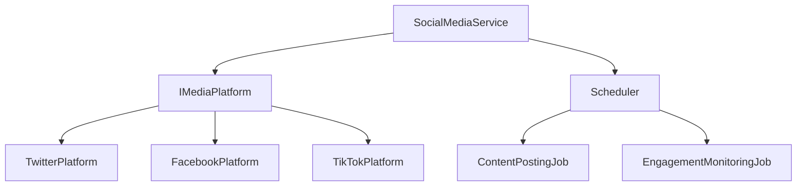

# Social Media Marketing Bot

A professional C#-based automation solution for social media marketing across Twitter, Facebook, and TikTok platforms. Built with enterprise-grade architecture and modern development practices.

## Key Features

### Core Functionality
- Multi-platform content publishing
- Intelligent content scheduling via Quartz.NET
- Automated engagement management
- Advanced analytics tracking
- Smart rate limiting and throttling
- Content optimization and variation

### Technical Features
- Clean architecture with SOLID principles
- Comprehensive unit and integration tests
- Docker containerization support
- Automated CI/CD pipeline
- Detailed API documentation
- Structured logging with Serilog

## Architecture



## Project Structure

```
SocialMediaBot/
├── src/                          # Source code
│   ├── Models/                   # Domain models
│   │   └── PostingSchedule.cs
│   ├── Platforms/               # Platform implementations
│   │   ├── IMediaPlatform.cs
│   │   ├── TwitterPlatform.cs
│   │   ├── FacebookPlatform.cs
│   │   └── TikTokPlatform.cs
│   └── Services/                # Core services
│       └── SocialMediaService.cs
├── tests/                       # Test projects
│   └── SocialMediaBot.Tests/
│       └── Platforms/
│           └── TwitterPlatformTests.cs
├── docs/                        # Documentation
│   └── API.md
├── .github/                     # CI/CD configuration
│   └── workflows/
│       └── ci-cd.yml
├── Program.cs                   # Application entry point
├── appsettings.json            # Configuration
├── Dockerfile                   # Container definition
├── docker-compose.yml          # Container orchestration
└── SocialMediaBot.csproj       # Project file
```

## Technical Requirements

### Development Environment
- .NET 7.0 SDK or later
- Visual Studio 2022 or VS Code
- Docker Desktop (optional)
- Git

### Platform Requirements
- Twitter API v2 credentials
- Facebook Graph API access token
- TikTok API credentials
- Valid SSL certificate for API calls

## Installation

### Standard Development Setup
1. Clone the repository:
```bash
git clone https://github.com/yourusername/SocialMediaBot.git
cd SocialMediaBot
```

2. Install dependencies:
```bash
dotnet restore
```

3. Configure settings:
- Copy `appsettings.example.json` to `appsettings.json`
- Update API credentials
- Adjust posting schedules

### Docker Deployment
1. Build the container:
```bash
docker-compose build
```

2. Start the service:
```bash
docker-compose up -d
```

## Development

### Building
```bash
dotnet build
```

### Running Tests
```bash
dotnet test
dotnet test --filter "Category=Integration"
```

### Code Quality
- Run style check:
```bash
dotnet format
```

- Run security scan:
```bash
dotnet security-scan
```

## Deployment

### CI/CD Pipeline
The project uses GitHub Actions for automated:
- Code building and testing
- Docker image creation
- Container registry publishing
- Production deployment

### Manual Deployment
1. Build release:
```bash
dotnet publish -c Release
```

2. Deploy artifacts:
```bash
docker push yourusername/socialmediabot:latest
```

## Monitoring & Maintenance

### Logging
- Console output for development
- Structured file logs in production
- Error tracking integration
- Performance metrics

### Health Checks
- API connectivity status
- Rate limit monitoring
- System resource usage
- Queue processing status

## Security

### Best Practices
- Secure credential storage
- API key rotation
- Rate limiting
- Request validation

### Compliance
- Platform Terms of Service
- Data protection regulations
- API usage guidelines
- Content policies

## Documentation

### API Reference
Comprehensive API documentation is available in [API.md](docs/API.md), covering:
- Platform interfaces
- Service implementations
- Configuration options
- Error handling

### Architecture
The system follows clean architecture principles:
- Domain-driven design
- Interface segregation
- Dependency injection
- SOLID principles

## Contributing

1. Fork the repository
2. Create a feature branch
3. Commit changes
4. Submit pull request

## License

This project is licensed under the MIT License - see the [LICENSE](LICENSE) file for details.

## Support

For support and questions:
- Open an issue
- Contact maintainers
- Check documentation

## Roadmap

### Upcoming Features
1. AI-powered content generation
2. Advanced analytics dashboard
3. Multi-account support
4. Custom plugin system

### Future Improvements
- Performance optimizations
- Additional platform support
- Enhanced monitoring
- ML-based engagement optimization
