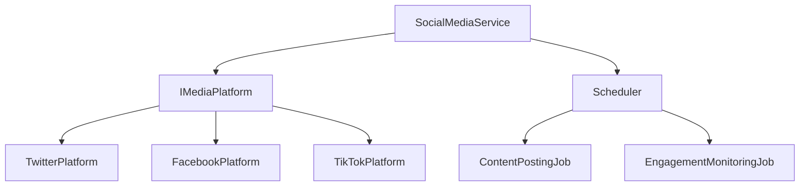

# Social Media Bot API Documentation

## Architecture Overview

The Social Media Bot is built on a modular architecture that follows SOLID principles and clean architecture patterns. The system is designed to be extensible, maintainable, and scalable.

### Core Components



## Platform Interfaces

### IMediaPlatform

The core interface that all platform implementations must implement.

```csharp
public interface IMediaPlatform
{
    Task<bool> PostContentAsync(string content, string? mediaPath = null);
    Task<bool> AutoReplyAsync();
    Task<bool> LikeRelatedContentAsync();
    Task<Dictionary<string, int>> GetMetricsAsync();
    Task<bool> CheckRateLimitAsync();
}
```

#### Method Details

##### PostContentAsync
Posts content to the social media platform.

Parameters:
- `content`: Required. The text content to post
  - Max length varies by platform
  - Supports hashtags and mentions
- `mediaPath`: Optional. Path to media file
  - Supported formats: JPG, PNG, MP4 (platform dependent)
  - Max file size varies by platform

Returns:
- `Task<bool>`: True if post was successful

Exceptions:
- `RateLimitException`: When platform rate limit is exceeded
- `MediaFormatException`: When media format is not supported
- `AuthenticationException`: When API credentials are invalid

##### AutoReplyAsync
Automatically engages with user interactions.

Features:
- Comment response
- Mention handling
- Direct message management

Returns:
- `Task<bool>`: True if auto-reply operations were successful

## Platform Implementations

### TwitterPlatform

Twitter-specific implementation using Twitter API v2.

```csharp
public class TwitterPlatform : IMediaPlatform
{
    public TwitterPlatform(
        string apiKey,
        string apiKeySecret,
        string accessToken,
        string accessTokenSecret,
        PostingSchedule schedule,
        ILogger<TwitterPlatform> logger)
```

Features:
- Tweet posting with media
- Thread creation
- Quote tweets
- Retweets and likes
- Analytics tracking

Rate Limits:
- 300 tweets per 3-hour window
- 1000 likes per 24-hour period
- 1000 follows/unfollows per 24-hour period

### FacebookPlatform

Facebook implementation using Graph API.

```csharp
public class FacebookPlatform : IMediaPlatform
{
    public FacebookPlatform(
        string accessToken,
        string pageId,
        PostingSchedule schedule,
        ILogger<FacebookPlatform> logger)
```

Features:
- Page posts
- Story creation
- Comment management
- Insights tracking
- Audience targeting

Rate Limits:
- 4800 API calls per app per hour
- 200 posts per page per hour

### TikTokPlatform

TikTok implementation using TikTok API.

```csharp
public class TikTokPlatform : IMediaPlatform
{
    public TikTokPlatform(
        string accessToken,
        PostingSchedule schedule,
        ILogger<TikTokPlatform> logger)
```

Features:
- Video upload
- Sound integration
- Effect application
- Hashtag challenges
- Analytics tracking

Rate Limits:
- 10,000 API calls per day
- 50 videos per hour

## Service Layer

### SocialMediaService

Orchestrates all platform operations and scheduling.

```csharp
public class SocialMediaService
{
    public SocialMediaService(
        TwitterPlatform twitterPlatform,
        FacebookPlatform facebookPlatform,
        TikTokPlatform tiktokPlatform,
        IScheduler scheduler,
        ILogger<SocialMediaService> logger)
```

Features:
- Cross-platform posting
- Unified analytics
- Centralized error handling
- Rate limit management
- Content scheduling

## Configuration

### PostingSchedule

Defines posting frequency and timing.

```csharp
public class PostingSchedule
{
    public int Frequency { get; set; }        // Posts per day
    public List<string> BestTimes { get; set; } // Optimal posting times
    public int MaxDailyPosts { get; set; }    // Daily post limit
    public bool EnableAutoReply { get; set; } // Auto-reply feature flag
}
```

## Error Handling

The system implements a comprehensive error handling strategy:

1. Exception Hierarchy
```csharp
public class SocialMediaBotException : Exception
public class RateLimitException : SocialMediaBotException
public class MediaFormatException : SocialMediaBotException
public class AuthenticationException : SocialMediaBotException
```

2. Retry Policies
- Exponential backoff
- Circuit breaker pattern
- Fallback mechanisms

## Logging

Structured logging using Serilog:

```csharp
Log.Logger = new LoggerConfiguration()
    .WriteTo.Console()
    .WriteTo.File("logs/social-media-bot.log", 
        rollingInterval: RollingInterval.Day)
    .CreateLogger();
```

Log Levels:
- `Error`: API failures, authentication issues
- `Warning`: Rate limit approaches, retry attempts
- `Information`: Successful posts, metrics updates
- `Debug`: Detailed operation tracking

## Best Practices

1. Content Management
   - Vary content across platforms
   - Respect platform-specific formats
   - Monitor engagement metrics

2. Rate Limiting
   - Implement proactive rate monitoring
   - Use token bucket algorithm
   - Cache rate limit status

3. Security
   - Store credentials securely
   - Use environment variables
   - Implement API key rotation

4. Performance
   - Batch operations where possible
   - Cache frequently accessed data
   - Use async/await properly

## Testing

The project includes comprehensive testing:

```csharp
public class TwitterPlatformTests
{
    [Fact]
    public async Task PostContentAsync_WithValidContent_ShouldReturnTrue()
    [Theory]
    [InlineData("")]
    [InlineData(null)]
    public async Task PostContentAsync_WithInvalidContent_ShouldReturnFalse()
}
```

Test Categories:
- Unit Tests
- Integration Tests
- Rate Limit Tests
- Error Handling Tests

## Monitoring

The system provides monitoring through:

1. Health Checks
2. Performance Metrics
3. Error Rates
4. API Usage Statistics

## Future Enhancements

Planned features:
1. AI-powered content generation
2. Advanced analytics dashboard
3. Multi-account support
4. Custom plugin system
